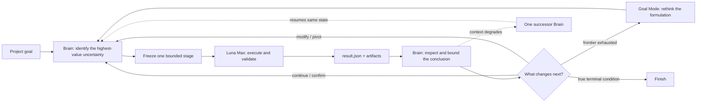

<div align="center">

# Autonomous Research Orchestrator

**A local-first Codex skill that keeps long-horizon empirical research moving—from the next decisive experiment to the next Brain.**

[](./SKILL.md)
[](./SKILL.md)
[](#safety-and-authorization)
[](./LICENSE)

[中文说明](./README.zh-CN.md) · [Skill specification](./SKILL.md) · [Report an issue](https://github.com/PilgrimCh/autonomous-research-orchestrator/issues)

</div>

Research rarely ends when one experiment finishes. The next useful step may be a confirmation run, a narrow repair, a route pivot, or a reformulation of the whole problem. This skill turns those transitions into one bounded autonomous session while preserving scientific ownership, accepted evidence, budgets, and context across long tasks.

It separates two roles deliberately:

- **Brain** owns the research goal, route selection, experiment design, interpretation, authorization, and stopping decisions.
- **Luna Max** performs every evidence-producing task through an ephemeral Codex CLI worker: code, data work, experiments, statistics, plots, and targeted validation.

## The loop



## What it adds

| Capability | What it means in practice |
|---|---|
| Continuous replanning | A stage ending is a transition, not an automatic stopping point. |
| Small route portfolio | Scout, focus, and confirmation routes stay bounded; blind grid search is rejected. |
| Brain–worker separation | Scientific policy stays with Brain; evidence production stays with the verified Luna worker. |
| Hypothesis-preserving debug | Execution blockers receive up to three bounded repair cycles and cannot masquerade as negative evidence. |
| Deterministic rollover | The first platform compaction recommends rollover; the second requires it and transfers to one successor Brain. |
| Persistent runtime | Goals, findings, budgets, active work, compaction state, and Brain lineage survive context rollover. |
| Goal Mode | Repeated inconclusive tweaks trigger a higher-level reformulation before infeasibility is declared. |
| Explicit authorization | Local finite work is the default; external calls, costs, uploads, and destructive actions are never inferred. |

## Quick start

### 1. Install the skill

Clone it into your personal Codex skills directory:

```powershell
$skillDir = Join-Path $env:USERPROFILE ".codex\skills\autonomous-research-orchestrator"
git clone https://github.com/PilgrimCh/autonomous-research-orchestrator.git $skillDir
```

If you already installed it:

```powershell
git -C "$env:USERPROFILE\.codex\skills\autonomous-research-orchestrator" pull
```

### 2. Invoke it from a research project

```text
Use $autonomous-research-orchestrator to initialize this project and pursue the
main research goal within conservative local limits. Keep going across stage
boundaries, preserve all evidence, and ask only when a real authorization gate
is reached.
```

The skill previews runtime initialization before applying it. To inspect the adapter manually:

```powershell
python "$env:USERPROFILE\.codex\skills\autonomous-research-orchestrator\scripts\init_autonomous_research.py" `
  --root "C:\path\to\project" `
  --project-id "my-project" `
  --title "My research project" `
  --goal "The final evidence-backed goal"
```

Add `--enable-autonomy --apply` only after the preview is correct.

## Runtime records

The runtime keeps a deliberately small authoritative surface:

| Record | Purpose |
|---|---|
| `task_plan.md` | Stable goal, formulation, constraints, and high-level strategy. |
| `findings.md` | Accepted evidence, bounded conclusions, and unresolved scientific questions. |
| `progress.md` | Current work, active route, resource use, and true blockers. |
| `artifacts/orchestration/pipeline_state.json` | Machine state, budgets, workers, routes, and append-only Brain lineage. |
| `artifacts/orchestration/brain_handoff.md` | One compact current rollover handoff—not a replacement for task history. |
| `result.json` | Task-local evidence plus explicit debug attempts, root cause, resolution, and experiment-resume status. |

## Safety and authorization

The explicit invocation enables a **finite, local-only** autonomous session when the project goal can be inferred. Conservative limits and zero external calls/cost are the defaults. It does not infer permission for paid APIs, authenticated services, downloads/uploads, destructive operations, untouched confirmation data, or scope expansion.

The runner also verifies the required `gpt-5.6-luna` / `max` worker identity. If that worker is unavailable, the session is preserved as platform-blocked instead of silently substituting a different model.

## Repository map

```text
autonomous-research-orchestrator/
├── SKILL.md                         # orchestration policy and main loop
├── agents/openai.yaml               # Codex UI metadata
├── assets/                          # schema-v4 state and handoff templates
├── references/
│   ├── authorization-and-stopping.md
│   ├── brain-luna-contract.md
│   ├── luna-cli-runner.md
│   ├── migration.md
│   └── runtime-and-rollover.md
└── scripts/
    ├── init_autonomous_research.py
    ├── run_luna_worker.py
    ├── runtime_control.py
    ├── simulate_autonomous_loop.py
    └── validate_autonomous_research.py
```

## Validation and development

Validate an initialized research root:

```powershell
python scripts\validate_autonomous_research.py --root "C:\path\to\project"
```

Run the orchestration simulation when changing the control design:

```powershell
python scripts\simulate_autonomous_loop.py
```

This project is intentionally opinionated. Contributions are welcome when they improve scientific decision quality, state integrity, or recovery without turning the runtime into governance for its own sake.

## License

[MIT](./LICENSE)
