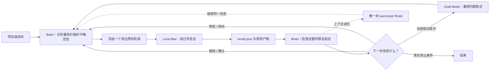

<div align="center">

# Autonomous Research Orchestrator

**一个本地优先的 Codex skill：让长周期实证研究从“下一个关键实验”持续推进到“下一代 Brain”。**

[](./SKILL.md)
[](./SKILL.md)
[](#安全与授权边界)
[](./LICENSE)

[English](./README.md) · [Skill 规范](./SKILL.md) · [反馈问题](https://github.com/PilgrimCh/autonomous-research-orchestrator/issues)

</div>

科研不会因为一次实验跑完就自然结束。下一步可能是确认实验、一次窄修复、路线切换，甚至重新定义整个问题。这个 skill 把这些转折组织成一个**有限、有授权边界、可跨上下文续航**的自主研究会话，同时保留科学决策权、已接受证据、资源预算与完整 Brain 任务谱系。

它有意把两种职责分开：

- **Brain**：负责项目目标、研究路线、实验设计、结果解释、授权和停止判断。
- **Luna Max**：通过临时 Codex CLI worker 执行一切产生证据的工作，包括代码、数据、实验、统计、绘图和定向验证。

## 核心闭环



## 它解决什么问题

| 能力 | 实际含义 |
|---|---|
| 连续重规划 | 一个阶段结束只是状态转移，不会自动停下来等用户续写提示词。 |
| 小型路线组合 | 用 `scout / focus / confirm` 控制探索深度，拒绝盲目笛卡尔积搜索。 |
| Brain–worker 分工 | 科学判断由 Brain 持有，证据生产交给经过身份验证的 Luna worker。 |
| 保留假设的自动 debug | 执行阻塞默认获得最多三轮修复，不能被伪装成 idea 的负结果。 |
| 确定性 rollover | 第一次平台上下文压缩建议轮换，第二次强制轮换并交给唯一 successor Brain。 |
| 持久运行时 | 目标、发现、预算、活动任务、压缩计数和 Brain 谱系在 rollover 后继续存在。 |
| Goal Mode | 连续的小修小补没有信息价值时，先提升抽象层级重构研究方向。 |
| 明确授权 | 默认只做有限的本地工作，不推断外部调用、付费、上传或破坏性权限。 |

## 快速开始

### 1. 安装 skill

将仓库克隆到个人 Codex skills 目录：

```powershell
$skillDir = Join-Path $env:USERPROFILE ".codex\skills\autonomous-research-orchestrator"
git clone https://github.com/PilgrimCh/autonomous-research-orchestrator.git $skillDir
```

如果已经安装：

```powershell
git -C "$env:USERPROFILE\.codex\skills\autonomous-research-orchestrator" pull
```

### 2. 在研究项目中调用

```text
使用 $autonomous-research-orchestrator 初始化当前项目，并在保守的本地资源限制内
持续推进主研究目标。不要在阶段边界自动停止，保存所有证据；只有遇到真实授权边界时
再向我提问。
```

skill 会先预览初始化计划，再实际落盘。也可以手动检查初始化适配器：

```powershell
python "$env:USERPROFILE\.codex\skills\autonomous-research-orchestrator\scripts\init_autonomous_research.py" `
  --root "C:\path\to\project" `
  --project-id "my-project" `
  --title "My research project" `
  --goal "最终需要达到的、由证据支持的目标"
```

只有确认预览无误后，才添加 `--enable-autonomy --apply`。

## 最小权威记录面

| 记录 | 作用 |
|---|---|
| `task_plan.md` | 稳定的项目目标、问题表述、约束与高层策略。 |
| `findings.md` | 已接受证据、边界化结论和未解决的科学问题。 |
| `progress.md` | 当前工作、活动路线、资源使用和真实阻塞。 |
| `artifacts/orchestration/pipeline_state.json` | 预算、worker、路线、状态及只追加的 Brain 谱系。 |
| `artifacts/orchestration/brain_handoff.md` | 当前唯一的紧凑 rollover handoff；不替代历史任务。 |
| `result.json` | 局部证据，以及 debug 尝试、根因、是否修复和原实验是否恢复。 |

## 安全与授权边界

显式调用这个 skill，只会在能够推断项目目标时开启一个**有限、本地优先**的自主会话。默认使用保守预算，外部调用和外部花费均为零。它不会自行推断付费 API、认证服务、下载/上传、破坏性操作、未触碰确认集或范围扩张的权限。

runner 还会验证所需的 `gpt-5.6-luna` / `max` worker 身份。如果平台无法提供该 worker，系统会保留会话并标记为平台阻塞，不会静默换成另一个模型。

## 仓库结构

```text
autonomous-research-orchestrator/
├── SKILL.md                         # 编排策略与主循环
├── agents/openai.yaml               # Codex UI 元数据
├── assets/                          # schema-v4 状态与交接模板
├── references/                      # 授权、Brain–Luna、CLI、迁移、rollover
└── scripts/                         # 初始化、运行、状态控制、模拟、验证
```

## 验证与开发

验证已经初始化的研究目录：

```powershell
python scripts\validate_autonomous_research.py --root "C:\path\to\project"
```

修改控制逻辑后运行编排模拟：

```powershell
python scripts\simulate_autonomous_loop.py
```

这个项目会保留明确的研究方法偏好。欢迎能提高科学决策质量、状态完整性或故障恢复能力，同时不过度增加治理负担的贡献。

## License

[MIT](./LICENSE)
